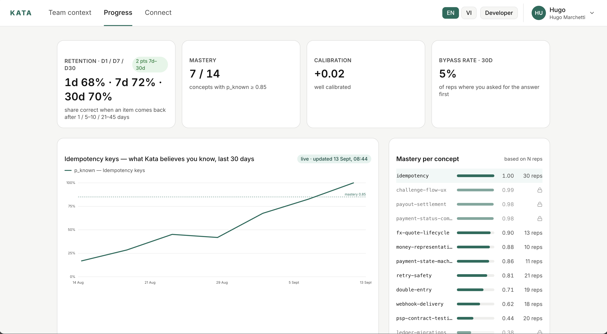
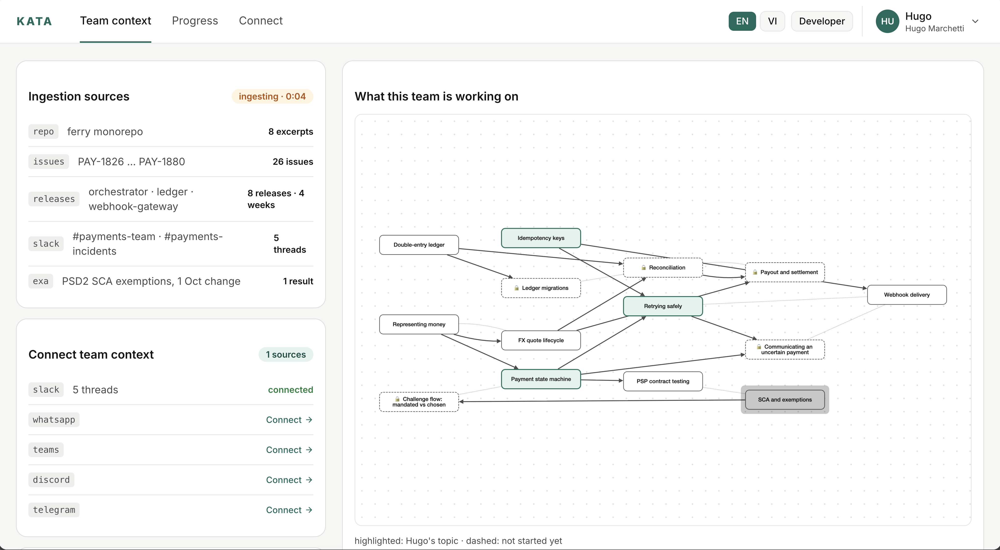
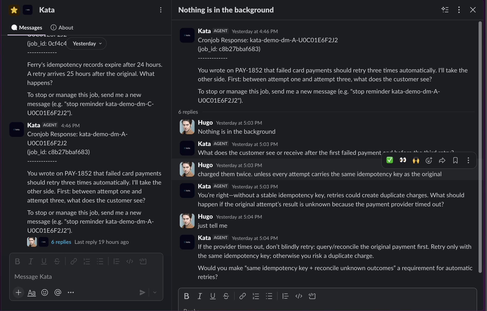
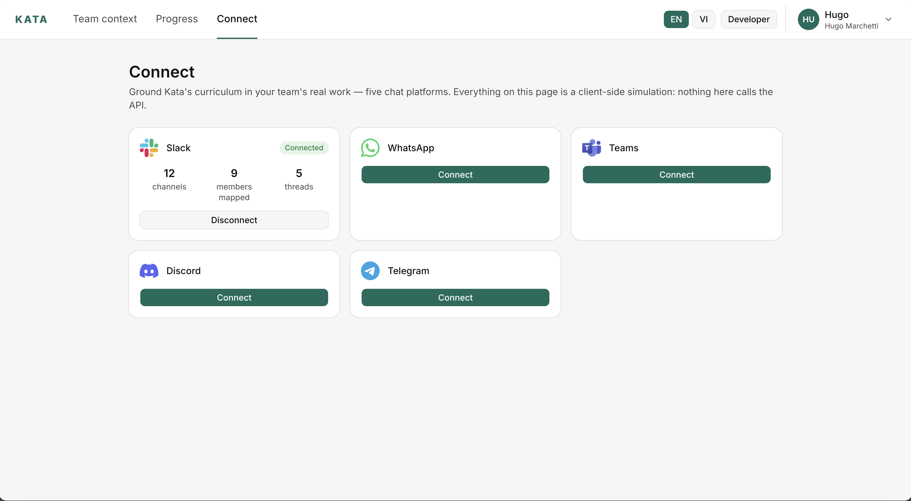
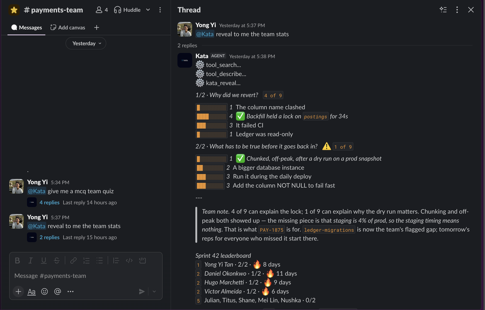
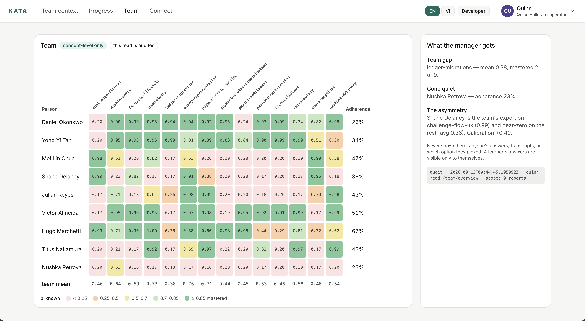

# Kata

**Our AI agents make us 10× faster. But we stop learning.**

Kata is a learning assistant for teams whose work increasingly involves AI.
It learns from the real work of the team, builds a picture of the ideas and
decisions people are encountering, and turns them into short moments of
practice and reflection. Kata does not rush to give the answer. It asks
people to reason, explain, and make sense of the problem for themselves
first; because the goal is not simply better output today, but stronger
human judgment tomorrow.

**As AI accelerates work, Kata accelerates human learning.**

Kata is source-available under the [Business Source License 1.1](LICENSE):
free for individuals and teams under 20 users, with no license keys, no
phone-home, and no usage telemetry. See [License](#-license) below.

## 🧠 The problem: cognitive debt

AI can dramatically increase what a team can accomplish, but when it takes
over more of the reasoning, people may learn less from the work itself.

That creates **cognitive debt**: the gap between what a team can accomplish
with AI and what its people can independently understand, explain, and
decide.

A [2025 MIT Media Lab study](https://www.media.mit.edu/publications/your-brain-on-chatgpt/)
found that people using an LLM showed weaker measures of brain connectivity
and poorer recall of their own writing than those who worked without one —
an early signal that getting the answer is not the same as learning.

**As AI accelerates work, human capability needs to grow alongside it.**

## 🥋 The solution: Kata

Kata puts learning back into the flow of work.

It turns the real work of a team — the problems being solved, decisions
being made, and ideas being developed — into small opportunities to
practise reasoning. Each person gets personalised, Socratic coaching in
the tools they already use.

Kata asks before it tells. It gives people space to form a view, explain
their thinking, and test their reasoning before revealing an answer.

The goal is not simply to help teams do more. It is to help people become
more capable as they do it: better at understanding, deciding, adapting,
and learning.

**As AI accelerates work, Kata accelerates human learning.**

## 🕸️ How it works: one learning core, any surface

- **Identity** - one person, resolved consistently across every connected
  surface ([`learning_service/identity`](learning_service/identity)).
- **Concept graph** - what your repo, issues, and releases actually teach,
  built from ingested sources and rendered as a graph per team
  ([`learning_service/curriculum`](learning_service/curriculum)).
- **FSRS-6 rep scheduling** and **BKT mastery** - a per-concept probability
  that you know it, driving what gets reviewed and when
  ([`learning_service/engine`](learning_service/engine)).
- **Retention, calibration, and bypass rate** - all derived from one
  append-only review log, never edited after the fact
  ([`learning_service/analytics`](learning_service/analytics)).

  
  

Every question traces to an actual ticket or issue - here, `PAY-1852` and the
retry wrapper on `#412` - and Kata pushes for the reasoning before it
confirms an answer, following up as the thinking gets sharper.

The **Hermes agent** is what sits in the chat - it normalises every channel
into one session and binds it back to your one identity. Slack is live
today; WhatsApp, Teams, Discord, and Telegram are adapters, not yet wired
into this demo.

## 💬 Team quizzes

Kata also runs a daily team quiz over Slack - multiple-choice, confidence-gated,
revealed only on command, and always scored as a team leaderboard, never a
name next to a wrong answer.

## 👀 What managers see

Managers get concept-level mastery across their team, not transcripts - a
learner's own answers are visible only to themselves, and every read is
audited.

## 🧰 Stack

FastAPI + Postgres for the learning core (an append-only review log is the
source of truth), a Hermes plugin for the Slack surface, and a web app built
with [CopilotKit](https://www.copilotkit.ai/) and [Auth0](https://auth0.com/)
for everything outside chat. [OpenRouter](https://openrouter.ai/) handles
model routing, Kata's bot voice runs on OpenAI, and [Exa](https://exa.ai/)
gives it web search.

## 🚀 Deployment

The learning service is one Docker image, deployed as three Railway
services (`learning`, `learning-retention`, `learning-replay`) distinguished
only by start command - see [`Dockerfile`](Dockerfile) and
[`deploy/kata`](deploy/kata) for topology and environment variables.

## ❤️ Contributing

Contributions are welcome - see [CONTRIBUTING.md](CONTRIBUTING.md) for the
Developer Certificate of Origin sign-off and the license grant every pull
request needs.

## 📄 License

Kata is licensed under the [Business Source License 1.1](LICENSE). This is
source-available, not Open Source by the OSI definition - the license
becomes [Apache License 2.0](https://www.apache.org/licenses/LICENSE-2.0)
automatically four years after each version's release.

Until then, the Additional Use Grant makes production use free for:

- an individual using Kata for themselves, not on behalf of an organisation;
- an organisation (with its parents, subsidiaries, and affiliates) with
  fewer than **20 distinct users** of Kata in any 30-day period;
- non-commercial personal study, classroom teaching, or academic research,
  at an organisation with fewer than 100 distinct users in any 30-day
  period.

Anyone above those thresholds, or offering Kata as a hosted or
software-as-a-service product, needs a commercial license - contact
Ai Soph Pte Ltd. There is no license key, registration check, or telemetry:
enforcement is on the honour system, by design, to keep Kata's
privacy-first posture intact.
